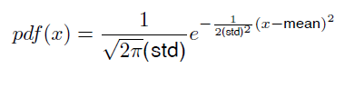
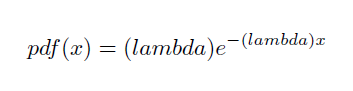

# Queue
this was a midterm exam for my ap course 
the main point was to design a queue so we can categorize students 
# Queue Class
Queue class has these members
* **pnext** :
For saving next item address
* **pvalue** :
For saving the item value that we want to keep
* **phead** :
Pointer for saving the head address (first item) 
* **ptail** : 
Pointer for saving tail address (last item)
and these functions 
* **enqueue** : 
This fucntion gets a new item and addes it to the end of queue
* **dequeue** : 
This function returns deletes the head item and returns it's value
#Student class 
This class should be an abstract class and it has these members and functions 
* **name** :
The student name should be in here the default value is my own name 
* **pdf** : 
It gets a number as input and calculates the probability of that student to acquire that score
* **integrator** : 
It gets three inputs (a , b , step_size) and calculates the intergrator based on Trapezoidal rule
* **between** : 
It gets two inputs (a , b) and calculates probability of that student to acquire that score between a and b based on Trapezoidal rule

# NormalStudent class
* **mean** : 
This variable is used for saving the mean value of Normal distribution and the default value is 12
* **std** : 
This variable is used for saving the Deviation value of Normal distribution and the default value is 2
* **pdf** : 
Same as Student class based on below formula


# ExponentialStudent class
* **lambda**: 
This variable is used for saving the Exponential distribution parameter and the default value is 0.07
* **pdf** : 
Same as Student class based on below formula


# Other Functions
* **getData**:
This function gets a csv file and every row is a student , it will return the students as the below vector
```c++
std::unique_ptr<Student> 
```

